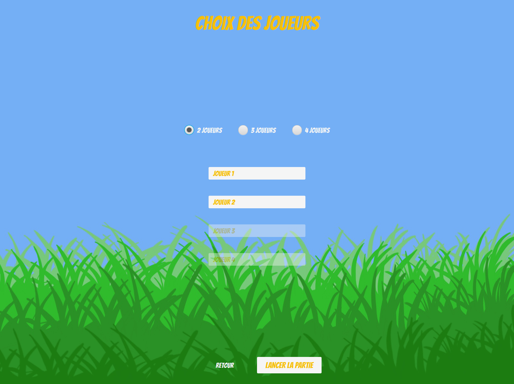

# SAE-Pickomino
## <u>Description du projet:</u>

    Notre projet vise a créer une application en JavaFX nous permettant de jouer au jeu 'Pickomino', voici une brève description du jeu:

    Pickomino est un **jeu de dés** amusant où vous devez **collectionner des vers**. Vous lancez **huit dés** et choisissez une **valeur à garder**. Ensuite, vous décidez si vous voulez relancer les dés restants ou non. Assurez-vous simplement de retenir une **valeur différente à chaque relance**. Si vous ne le faites pas, vous devez rendre un Pickomino et passer votre tour. À la fin de chaque tour, vous comptez vos points pour voir quel Pickomino vous pouvez prendre. Vous pouvez les obtenir de la réserve ou même voler ceux des autres joueurs. Pickomino est un **jeu de stratégie** où vous devez faire des choix intelligents pour collecter le plus de vers possible et marquer des points.

## <u>Installation du jeu:</u>

    Pour lancer notre jeu vous devrez d'abord télécharger le dépot git de ce projet, puis le lancer a l'aide d'un interpréteur suportant le language de programmation Kotlin. Il n'y a pas besoin de configuration pour le lancer.

## <u>Utilisation:</u>

Le jeu se lance en lançant le fichier src/main/kotlin/Main.kt, la page d'accueil s'affiche :

### <u>Page d'accueil:</u>

Sur cette page d'accueil nous avons 4 fenêtre, Jouer, règles, options et quitter, voici leurs fonctionnements.

### <u>Jouer:</u>

La fenêtre jouer permet de lancer une partie et de préciser le nombre de joueur et leurs pseudo:

#### <u>Lancer la partie:</u>

Puis quand on clique sur 'Lancer la partie' cette fenêtre avec le jeu s'affiche:

### <u>Règles:</u>

La fenêtre règle, lorsqu'on clique dessus elle affiche toute les règles du jeux pikomino comme ceci:

On peut passer d'une page de règle a l'autre avec les boutons présent sur les cotés.

### <u>Options:</u>

La fenêtre option permet d'activer une musique de jeux et le son des boutons ainsi de régler leur volume.

### <u>Quitter:</u>

La fenêtre quitter permet de quitter le jeu.

## <u>Remerciement:</u>

    Nous avons soigneusement conçu une interface conviviale et intuitive pour vous permettre de plonger facilement dans l'univers de Pickomino. Les fonctionnalités clés, telles que la sélection des dés, les relances stratégiques et le calcul des points, sont toutes présentes pour vous offrir une expérience de jeu fluide et immersive.

    Nous espérons que notre application vous procurera autant de plaisir à y jouer que nous en avons eu à la développer. N'hésitez pas à explorer les différentes fonctionnalités, à défier vos amis et à partager vos scores les plus élevés.

    Nous vous remercions de votre intérêt pour notre projet et nous espérons que vous apprécierez pleinement votre expérience de jeu avec notre application Pickomino.

Cordialement,
XX_TheDestroyer44_XXff

